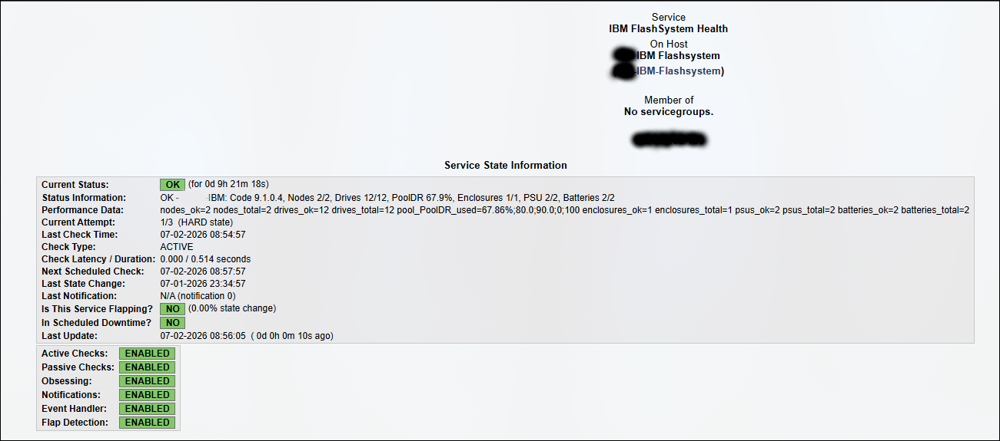

# check_ibm_flashsystem

Nagios Core plugin for IBM FlashSystem / IBM Storage Virtualize using the REST API.

This release is intentionally sanitized for public GitHub use:

- No real IP addresses
- No real usernames
- No passwords in examples
- No tokens in examples
- No command-line password option
- Credentials are supplied only by password file or environment variable

Tested with IBM Storage Virtualize 9.1.x.

## Checks

- REST API connectivity
- Authentication
- System name and code level
- Node canisters
- Drives
- Storage pools and pool utilization
- Enclosures
- Power supplies
- Batteries

## Requirements

- Python 3.8+
- `requests`

Install dependency:

```bash
pip3 install -r requirements.txt
```

On Debian/Ubuntu systems you can also use:

```bash
apt install python3-requests
```

## Secure credential handling

Do not put storage passwords directly on the command line or inside public Git repositories.

Recommended method: password file readable only by the Nagios user.

```bash
install -o nagios -g nagios -m 600 /dev/null /etc/nagios/flashsystem.pass
nano /etc/nagios/flashsystem.pass
chmod 600 /etc/nagios/flashsystem.pass
chown nagios:nagios /etc/nagios/flashsystem.pass
```

The file should contain only the FlashSystem monitoring user's password.

Alternative method: environment variable.

```bash
export FLASHSYSTEM_PASSWORD='your_password_here'
```

Do not commit password files, token files, shell history, or `.env` files to Git.

## Usage

Using a password file:

```bash
./check_ibm_flashsystem.py \
  -H flashsystem.example.local \
  -u monitoring_user \
  --password-file /etc/nagios/flashsystem.pass
```

Using an environment variable:

```bash
./check_ibm_flashsystem.py \
  -H flashsystem.example.local \
  -u monitoring_user \
  --password-env FLASHSYSTEM_PASSWORD
```

With custom pool thresholds:

```bash
./check_ibm_flashsystem.py \
  -H flashsystem.example.local \
  -u monitoring_user \
  --password-file /etc/nagios/flashsystem.pass \
  -w 80 \
  -c 90
```

Example output:

```text
OK - FlashSystem-01: Code 9.1.x, Nodes 2/2, Drives 12/12, Pool_01 67.8%, Enclosures 1/1, PSU 2/2, Batteries 2/2 | nodes_ok=2 nodes_total=2 drives_ok=12 drives_total=12 pool_Pool_01_used=67.80%;80.0;90.0;0;100
```

## Options

```text
-H, --host              FlashSystem management IP or hostname
--port                 REST API port, default: 7443
-u, --username          FlashSystem monitoring username
--password-file         File containing the password
--password-env          Environment variable containing the password
-w, --warning           Pool utilization warning threshold, default: 80
-c, --critical          Pool utilization critical threshold, default: 90
--battery-min-charge    Battery minimum charge warning threshold, default: 80
--timeout               REST API timeout in seconds, default: 10
--json                  Output JSON instead of Nagios text
--version               Show plugin version
-v, --verbose           Add verbose details
--ignore-enclosure      Skip enclosure check
--ignore-psu            Skip PSU check
--ignore-batteries      Skip battery check
--ignore-pools          Skip pool check
```

## Nagios command example

```cfg
define command{
    command_name    check_ibm_flashsystem
    command_line    $USER1$/check_ibm_flashsystem.py -H $HOSTADDRESS$ -u $ARG1$ --password-file $ARG2$ -w $ARG3$ -c $ARG4$
}
```

## Nagios host example

```cfg
define host{
    use         generic-switch
    host_name   flashsystem-01
    alias       IBM FlashSystem 01
    address     flashsystem.example.local
}
```

## Nagios service example

```cfg
define service{
    use                     generic-service
    host_name               flashsystem-01
    service_description     IBM FlashSystem Health
    check_command           check_ibm_flashsystem!monitoring_user!/etc/nagios/flashsystem.pass!80!90
}
```

## Nagios output format

The plugin uses a single Nagios perfdata separator (`|`). Everything before `|` is human-readable status text shown in the Nagios UI. Everything after `|` is perfdata.

## Security notes

- Create a dedicated read-only monitoring user on the FlashSystem.
- Do not use `superuser` for monitoring.
- Do not pass the password directly as a command-line argument.
- Restrict password file permissions to the Nagios service account.
- Do not commit credentials, tokens, real hostnames, or production IPs.
- Use HTTPS only. The plugin disables certificate validation by default because many arrays use self-signed certificates; consider adding certificate validation support in environments with internal CA certificates.

<h2>Screenshot</h2>

<p align="center">
  
</p>

## License

MIT
